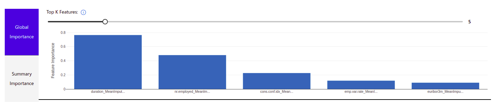
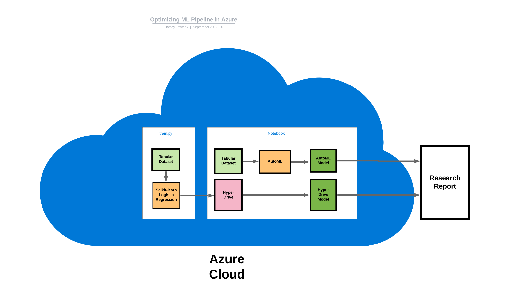
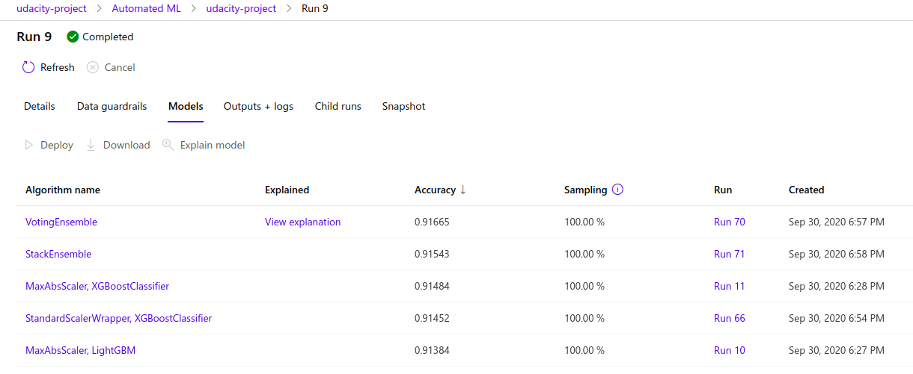
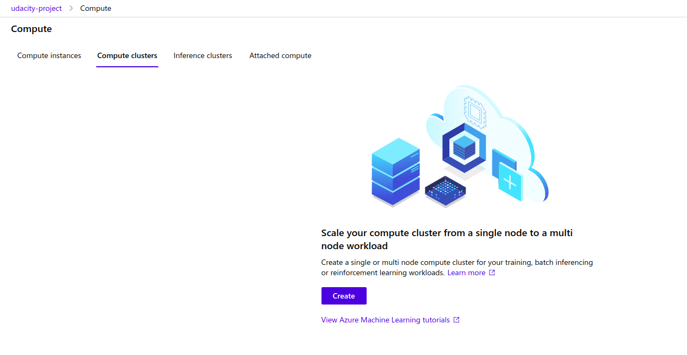

# Optimizing an ML Pipeline in Azure

## Overview
This project is part of the Udacity Azure ML Nanodegree.
In this project, we build and optimize an Azure ML pipeline using the Python SDK and a provided Scikit-learn model.
This model is then compared to an Azure AutoML run.

## Summary
This <a href="https://automlsamplenotebookdata.blob.core.windows.net/automl-sample-notebook-data/bankmarketing_train.csv">dataset</a> contains data about marketing campaigns of a Portuguese banking institution. The marketing campaigns were based on phone calls. Often, more than one contact to the same client was required, in order to access if the product (bank term deposit) would be ('yes') or not ('no') subscribed. In our model, We seek to predict if the client will subscribe a term deposit (variable y).

The best performing model was **Voting Ensemble** model with accuracy of 0.916, the graph shows the top 5 features the model used in predicting whether the client will subscribe a term deposit or not.

## Architectural Diagram

## Scikit-learn Pipeline

First, we will start by optimizing a logistic regression model using HyperDrive. We start by setting up a training script `train.py` where we create a dataset, train and evaluate a logistic regression model from `Scikit-learn`. Then, we move on to the notebook and use `HyperDrive` to find optimal hyperparameters. `HyperDrive` Will help us to find the best hyperparameters of our model. Our final model from the `Scikit-learn` Pipeline is the output of the `HyperDrive` tunning.

We will use `RandomParameterSampling` which Defines random sampling over a hyperparameter search space to sample from a set of discrete values for `max_iter` hyperparameter and from a uniform distribution for `C` hyperparameter. This will make our hyperparameter tunning more efficient.

We will also use `BanditPolicy` which defines an early termination policy based on slack criteria, and a frequency and delay interval for evaluation. The `slack_factor` is the amount of slack allowed with respect to the best performing training run. The `evaluation_interval` is the frequency for applying the policy. Each time the training script logs the primary metric counts as one interval.

## AutoML

Second, We will optimize the model using AutoML. AutoMl explores a wide range of models like XGBoost, LightGBM, StackEnsemble and a lot more. So, it's more probable to find a better than logistic regression as we are exploring more models. The wining model for AutoML is VotingEnsemble model which involves summing the predictions made by multiple other classification models.

## Pipeline comparison

The AutoMl model is slightly better than the logistic regression model in accuracy with less than 0.006. The wining model was VotingEnsemble model which involves summing the predictions made by multiple other classification models. While the architecture of the logistic regression has the advantage of being much simpler than the VotingEnsemble model. Logistic regression is weighted sum of input passed through the sigmoid activation function.

## Future work

One of the future experiments I will conduct is to try different primary performance metrics. For example, using `AUC_weighted`, `average_precision_score_weighted`, or `precision_score_weighted`. Choosing the right evaluation metric for the problem will be helpful for model training. Also, I will consider to try different sampling methods for hyperparameters.

## Cluster clean up

Before closing the experiment, I cleaned up the resources I used on Azure cloud.

